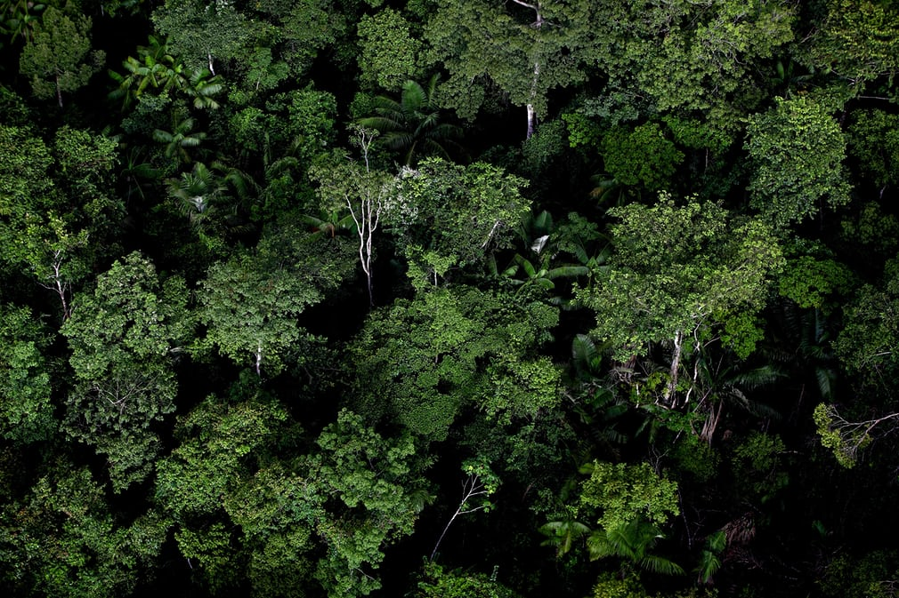
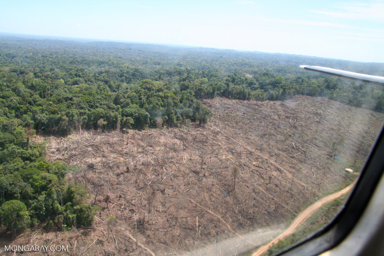
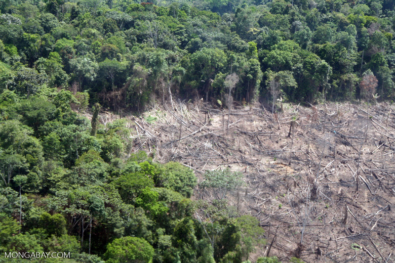
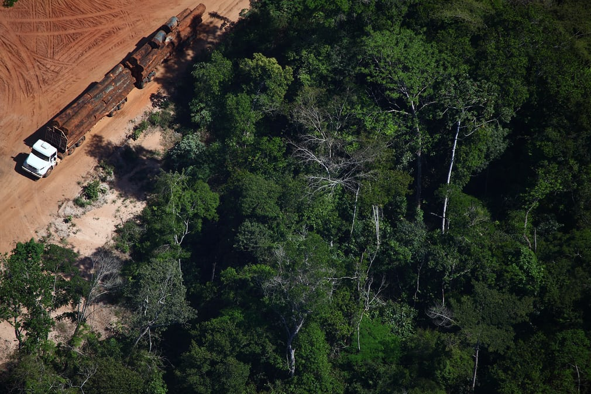
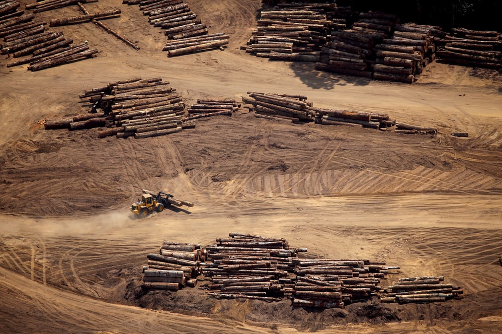

```{r setup, include=FALSE}
knitr::opts_chunk$set(echo = TRUE)
```

### <span style="color:red"><b>Amazon Rainforest</b></span>
The Amazon rainforest is a forest in the Amazon that covers most of the Amazon basin of South America. This basin encompasses 2,700,000 square miles, of which 2,100,000 square miles are covered by the rainforest. This region includes territory belonging to nine nations. The majority of the forest is contained within Brazil, with 60% of the rainforest, followed by Peru with 13%, Colombia with 10%, and with minor amounts in Venezuela, Ecuador, Bolivia, Guyana, Suriname and French Guiana. 

The Amazon represents over half of the planet's remaining rainforests, and comprises the largest and most biodiverse tract of tropical rainforest in the world, with an estimated 390 billion individual trees divided into 16,000 species.[1][2]

The region is home to about 2.5 million insect species, tens of thousands of plants, and some 2,000 birds and mammals. To date, at least 40,000 plant species, 2,200 fishes,[32] 1,294 birds, 427 mammals, 428 amphibians, and 378 reptiles have been scientifically classified in the region. One in five of all bird species are found in the Amazon rainforest, and one in five of the fish species live in Amazonian rivers and streams. Scientists have described between 96,660 and 128,843 invertebrate species in Brazil alone.[31][33][34]

From guardian
<div id="picture00"></div> <br>

### <span style="color:red"><b>Deforestation</b></span>
Deforestation is the conversion of forested areas to non-forested areas. The main sources of deforestation in the Amazon are human settlement and development of the land.[41] Prior to the early 1960s, access to the forest's interior was highly restricted, and the forest remained basically intact.Farms established during the 1960s were based on crop cultivation and the slash and burn method. However, the colonists were unable to manage their fields and the crops because of the loss of soil fertility and weed invasion.The soils in the Amazon are productive for just a short period of time, so farmers are constantly moving to new areas and clearing more land. These farming practices led to deforestation and caused extensive environmental damage. Deforestation is considerable, and areas cleared of forest are visible to the naked eye from outer space. [43][44] 

### <span style="color:red"><b>Clearcutting</b></span>
Clearcutting, clearfelling or clearcut logging is a forestry/logging practice in which most or all trees in an area are uniformly cut down. Along with shelterwood and seed tree harvests, it is used by foresters to create certain types of forest ecosystems and to promote select species[1] that require an abundance of sunlight or grow in large, even-age stands. Logging companies and forest-worker unions in some countries support the practice for scientific, safety and economic reasons, while detractors consider it a form of deforestation that destroys natural habitats and contributes to climate change.[2][3] 

Clearcutting is the most common and economically profitable method of logging. However, it also creates detrimental side effects, such as the loss of topsoil, the costs of which are intensely debated by economic, environmental and other interests. In addition to the purpose of harvesting wood, clearcutting is used to create land for farming. The "insatiable human demand for wood and arable land" through clearcutting and other activities has led to the loss of over half of the world's rainforests.[5][6]

While deforestation of both temperate and tropical rainforests through clearcutting has received considerable media attention in recent years, the other large forests of the world, such as the taiga, also known as boreal forests, are also under threat of rapid development. In Russia, North America and Scandinavia, creating protected areas and granting long-term leases to tend and regenerate trees-thus maximizing future harvests-are among the means used to limit the harmful effects of clearcutting [7]. Long-term studies of clearcut forests, such as studies of the Pasoh Rainforest in Malaysia, are also important in providing insights into the preservation of forest resources worldwide[8].

### <span style="color:red"><b>Deforestation vs Clearcutting</b></span>
Clear-cutting is used as a method of regenerating or rejuvenating certain kinds of trees, while deforestation is the complete alliteration of an area of forestry, and using that area for some other use.


#### <span style="color:red"><b>Cons of Deforestation</b></span>
Deforestation destroys the habitats of species of plants and animals
Deforestation leaves the soil bare, over time the soil will lose its fertility.
The removal of trees adds to the high levels of carbon dioxide in the atmosphere. 


#### <span style="color:red"><b>Pros of Deforestation</b></span>
Deforestation provides the materials for a lot of jobs. The forest products industry is a large part of the economy 
It opens more job opportunities
Cutting down trees provides charcoal, which is another source of energy.

#### <span style="color:red"><b>Cons of Clear-cutting</b></span>
A clear-cut increases soil erosion, water degradation and increased silting in creeks, rivers and reservoirs.
Clear-cutting compromises aesthetics and quality forest views.

#### <span style="color:red"><b>Pros of Clear-cutting</b></span>
The regeneration of tree species
The regeneration of stands of tree species that is dependent on wind blown seed, root suckers or cones that need fire to drop seed.
To create habitats for wildlife species that require edge, new ground and high-density, even-aged stands.

<div id="picture01"></div> <br>

<div id="picture02"></div> <br>

### <span style="color:red"><b>Environmental Impact</b></span>

One of the major concerns arising from deforestation in Brazil is the global effect it produces on climatic change. Rain forests, of vital importance in the carbon dioxide exchange process, are second only to oceans as the most important sinks on the planet for absorbing the increasing atmospheric carbon dioxide resulting from industry.

The most recent survey on deforestation and greenhouse gas emissions reports that deforestation in the Brazilian Amazon is responsible for as much as 10% of current greenhouse gas emissions due to the removal of forest which would otherwise have absorbed the emissions, and has a clear effect on global warming. The method often used to remove the forest, where many trees are burned to the ground, emits vast amounts of carbon dioxide into the atmosphere, affecting air quality not just in Brazil but globally.

Environmental groups criticize clear-cutting as destructive to water, soil, wildlife, and atmosphere, and recommend the use of sustainable alternatives.[12] Clear-cutting has a very big impact on the water cycle. Trees hold water and topsoil. Clear-cutting in forests removes the trees which would otherwise have been transpiring large volumes of water and also physically damages the grasses, mosses, lichens, and ferns populating the understorey. All this bio-mass normally retains water during rainfall. Removal or damage of the biota reduces the local capacity to retain water, which can exacerbate flooding and lead to increased leaching of nutrients from the soil. The maximum nutrient loss occurs around year two, and returns to pre-clearcutting levels by year four [13].

Clear-cutting also prevents trees from shading riverbanks, which raises the temperature of riverbanks and rivers, contributing to the extinction of some fish and amphibian species.[where?] Because the trees no longer hold down the soil, riverbanks increasingly erode as sediment into the water, creating excess nutrients which exacerbate the changes in the river and create problems miles away, in the sea [12].All of the extra sediment and nutrients that leach into the streams cause the acidity of the stream to increase, which can kill marine life if the increase is great enough [13].The nutrient content of the soil was found to return to five percent of pre-clearcutting levels after 64 years, which demonstrates how clearcutting affects the environment for many years [14].

Clearcutting can destroy an area's ecological integrity in a number of ways, including: the destruction of buffer zones which reduce the severity of flooding by absorbing and holding water; the immediate removal of forest canopy, which destroys the habitat for many rainforest-dependent insects and bacteria; the removal of forest carbon sinks, leading to global warming through the increased human-induced and natural carbon dioxide build-up in the atmosphere; the elimination of fish and wildlife species due to soil erosion and habitat loss; the removal of underground worms, fungi and bacteria that condition soil and protect plants growing in it from disease; the loss of small-scale economic opportunities, such as fruit-picking, sap extraction, and rubber tapping; and the destruction of aesthetic values and recreational opportunities [15].

From guardian
<div id="picture03"></div> <br>

### <span style="color:red"><b>Steps taken to stop clearcutting?</b></span>
How did Brazil accomplish such a drastic change?

#### <span style="color:red"><b>Protected Areas</b></span>
Over half of the Brazilian Amazon is now designation as national parks or indigenous lands, effectively protecting an area larger than Greenland from intensive logging and agriculture. The push for more protected areas began in 2003, pioneered by a new Brazilian administration that was determined to curb deforestation and illegal logging. The recognition of indigenous land rights ensures the cooperation of locals and serves to preserve their way of life as well as the forest.

#### <span style="color:red"><b>Industry Cooperation</b></span>
Historically, cattle ranching has been the greatest driver of deforestation in the Amazon, followed in recent decades by growing global demand for soybeans. In 2006, mounting political pressure and bad publicity associated with rainforest destruction pushed the two biggest buyers of Brazilian soybeans, Cargill and McDonalds, to freeze their purchases of soybeans sourced from recently cleared rainforest. Such action led to a national moratorium on soybeans grown on land that had been deforested since 2006, discouraging deforestation in the process. The cattle industry followed suit in 2009, as packing plants and slaughterhouses in Brazil refused to source cattle from ranches within 10km of deforestation fronts. In spite of these new restrictions, the cattle and soybean industries have done well in Brazil, increasing in size and scope in the face of surging international demand.

#### <span style="color:red"><b>Satellite Monitoring</b></span>
Protected areas and geographical restrictions on the spread of soybeans and ranching are great in theory, but without monitoring it is hard to prove that such restrictions are being adhered to. In order to monitor the pace of deforestation, the Brazilian Space Agency launched it's DETER satellite in 2004. DETER monitors changes in forest cover in real time, producing a report of deforestation hotspots for law enforcement every two weeks. Satellite monitoring in Brazil is estimated to have prevented deforestation of 59,000 square kilometers of rainforest from 2007 to 2011.

#### <span style="color:red"><b>Improved enforcement</b></span>
Scale poses a huge hurdle for any government agency seeking to enforce wildlife law over a large area. The Amazon rainforest covers a whopping 5.5 million square kilometers, and even with satellites flying overhead, someone has to be on the ground to enforce forestry laws. The Brazilian government got tough on rainforest crime with a series of high profile fines for violators by focusing their efforts on patrolling roads leading into the rainforest. Such focus by law enforcement increased the efficiency of patrols over such a large area.

#### <span style="color:red"><b>International Incentives</b></span>
The connection between deforestation and worsening climate change actually helped the Amazon by engaging the larger global community in rainforest conservation. With the goal of reducing emissions from deforestation, the UN established the Reducing Emissions from Deforestation and Forest Degradation Programme, or REDD+, at the 2007 climate summit in Bali. Through this program, industrialized countries with high carbon emissions pay for carbon storage by preserving forests in developing countries. This offers developing countries additional economic incentives to preserve their forests and to keep emissions low.

Norway has emerged as a leading force in forest conservation by pledging $1 billion to rainforest preservation efforts in the Amazon, or $5 per ton of sequestered carbon. For the plan to be effective, Brazil was paid only after measurable decreases in deforestation had been observed, a process known as a pay for performance program. Such a program sends a powerful message to developing countries that the international community values forests and will help foot the bill for protecting them.

#### <span style="color:red"><b>Political Will</b></span>
The establishment of protected areas, investment into satellite monitoring, increased law enforcement, and the cooperation of key industries doesn't just happen overnight. An incredible amount of political will was required to accomplish such changes, and the Brazilian people deserve the majority of the credit for creating a social movement. The Zero Deforestation movement, pressure from numerous NGOs, as well as the cooperation of environmentalists, indigenous groups, rubber trappers, and unions, paved the way for the government actions described above.

From guardian
<div id="picture04"></div> <br>

### <span style="color:red"><b>References</b></span>
<li>https://www.theguardian.com/global-development-professionals-network/gallery/2017/jan/30/state-amazon-rainforest-deforestation-brazil-in-pictures </li>
<li>https://rainforests.mongabay.com/amazon/amazon_destruction.html </li>
<li>https://old.datahub.io/dataset/amazon-rainforest-dataset </li>
<li>http://linkedscience.org/data/linked-brazilian-amazon-rainforest/ </li>
<li>https://www.nationalgeographic.org/photo/biodiv-clearcut/ </li>
<li>https://en.wikipedia.org/wiki/Deforestation_in_Brazil </li>
<li>https://globalforestatlas.yale.edu/amazon/forest-governance/brazil </li>
<li>https://www.theguardian.com/world/2015/nov/27/amazon-deforestation-report-brazil-paris-climate-talks </li>
<li>https://www.aaas.org/news/science-clear-cutting-declines-brazil-s-rainforest-fires-are-rise </li>
<li>https://www.culturalsurvival.org/publications/cultural-survival-quarterly/deforestation-human-costs </li>
<li>https://www.scientificamerican.com/article/deforestation-and-global-warming/ </li>
<li>https://www.nasa.gov/centers/goddard/news/topstory/2006/brazil_logging.html </li>
<li>https://greenliving.lovetoknow.com/environmental-issues/effects-clear-cutting </li>

<br><br>
