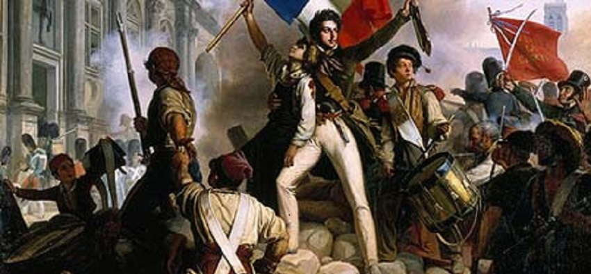
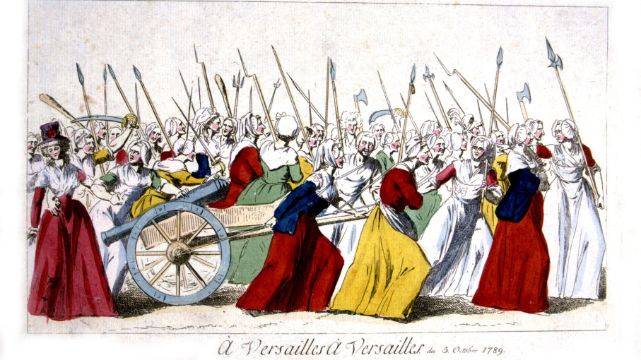

```{r setup, include=FALSE}
knitr::opts_chunk$set(echo = TRUE)
```

#### <span style="color:red"><b>1) Reign of Terror: </b></span>
The reign of terror began after the death of king Louis XVl in 1793. Originally, the Committee of Public Safety was created to keep the reforms of the revolution. The main leader of this committee was Maximilien Robespierre. One of the major goals was to stop any counterrevolutionary threats which resulted in a major number of executions. The large number of executions is what gave this period its nickname. This time ended when the National Convention joined the enemies of Robespierre to overthrow him. 

<div id="picture1"></div>

#### <span style="color:red"><b>2) The "Declaration of the Rights of Man": </b></span>
The reign of terror began after the death of king Louis XVl in 1793. Originally, the Committee of Public Safety was created to keep the reforms of the revolution. The main leader of this committee was Maximilien Robespierre. One of the major goals was to stop any counterrevolutionary threats which resulted in a major number of executions. The large number of executions is what gave this period its nickname. This time ended when the National Convention joined the enemies of Robespierre to overthrow him. 


#### <span style="color:red"><b>3) Women's March on Versailles: </b></span>
The Women's march on Versailles happen on October 1789 when a large crowd marched to Versailles. The people in the crowd had mixed intentions some wanted to petition for bread shortages to the king while others wanted retribution against Marie Antoinette. It took about one day to finally get the king and the assembly to accompany the mob go with the mob to Paris. The march was successful in bringing the king to France and forcing the king to accept the reforms. 

<div id="picture2"></div>

#### <span style="color:red"><b>4) The Execution of Louis XVI: </b></span>
The Women's march on Versailles happen on October 1789 when a large crowd marched to Versailles. The people in the crowd had mixed intentions some wanted to petition for bread shortages to the king while others wanted retribution against Marie Antoinette. It took about one day to finally get the king and the assembly to accompany the mob go with the mob to Paris. The march was successful in bringing the king to France and forcing the king to accept the reforms. 

#### <span style="color:red"><b>5) References: </b></span>
<li>http://www.historywiz.com/terror.htm </li>
<li>https://www.encyclopedia.com/history/modern-europe/french-history/reign-terror </li>
<li>http://avalon.law.yale.edu/18th_century/rightsof.asp </li>
<li>http://alphahistory.com/frenchrevolution/declaration-rights-of-man-and-citizen/ </li>
<li>http://alphahistory.com/frenchrevolution/october-march-on-versailles/ </li>
<li>https://www.thoughtco.com/womens-march-on-versailles-3529107 </li>
<li>https://www.history.com/this-day-in-history/king-louis-xvi-executed </li>
<br><br>
